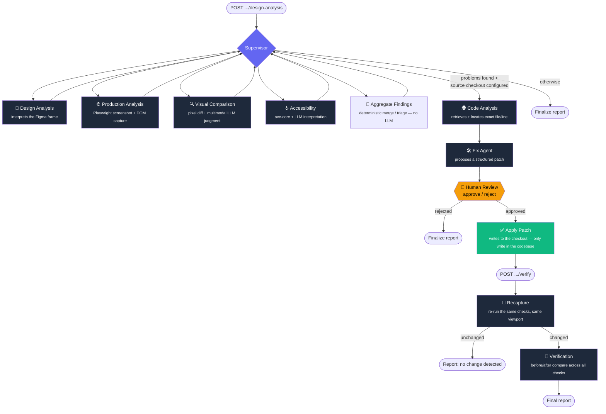
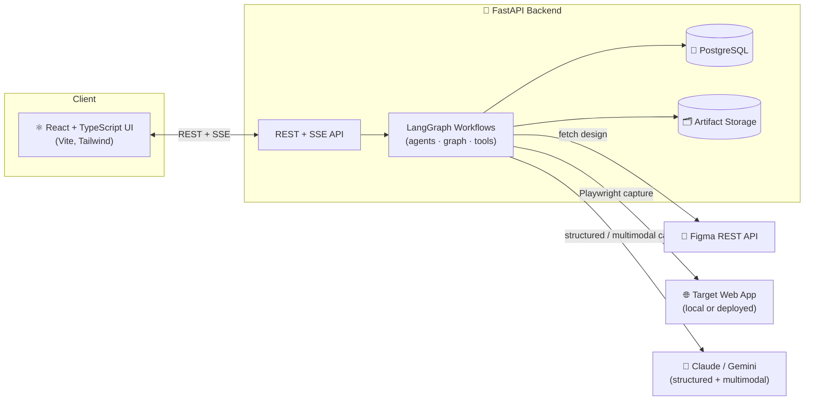

<div align="center">

#  🎨 Design Drift

### Autonomous AI Design QA & Remediation Platform

**Catch the gap between Figma and production -- before your users do!**

Design Drift compares a Figma design against a real, deployed (or local)
web app, detects drift across visuals, layout, typography, color, and
accessibility, then autonomously locates the responsible code, proposes a
fix, and — once a human signs off — applies and verifies it.

[](https://www.python.org/)
[](https://fastapi.tiangolo.com/)
[](https://react.dev/)
[](https://www.typescriptlang.org/)
[](https://www.langchain.com/langgraph)
[](https://www.postgresql.org/)
[](LICENSE)

</div>

---

## ✨ What is this?

Design QA is normally a human squinting at two browser tabs. Design Drift
turns that into a **pipeline of specialized AI agents**, each doing one job
well — inspecting a Figma file, inspecting a live page, comparing them,
running accessibility audits, tracing a finding back to a line of source
code, and drafting a fix — all coordinated by a supervisor, all stopping to
ask a human before anything gets written or applied.

It's also a **from-scratch AI engineering build**: real LangGraph state
machines, structured LLM outputs, multimodal reasoning, tool-calling agents,
and human-in-the-loop control — built on top of a genuinely
production-shaped app, not a toy.

> **Status — Phase 3: the full workflow is live.** One API call runs a
> Supervisor through four inspection agents, deterministic aggregation, a
> Code Analysis agent, and a Fix agent. A human reviews the proposed patch;
> once approved, it's applied to the checkout and re-verified by a second
> workflow that recaptures the page and reports before/after results.
> Nothing is ever applied, committed, or pushed without explicit approval.

---

## 🧠 How it works

Design Drift runs as **two LangGraph workflows**: one that inspects and
proposes, one that verifies after a fix lands.



**No fake AI.** Anything with a deterministic answer is computed
deterministically — Playwright/DOM APIs for element geometry, axe-core for
accessibility rule violations, `pixelmatch` for pixel-level diffing, plain
Python for merging findings agents already judged. The LLM is reserved for
what actually needs reasoning: interpreting design intent, judging whether
a visual difference *matters*, tracing a finding to code, and proposing a
remediation.

### System overview



---

## 🚀 Key features

| | |
|---|---|
| 🎨 **Design-to-code drift detection** | Compares a Figma frame against a live render — pixel diff *and* LLM judgment on what's actually material. |
| ♿ **Accessibility auditing** | Deterministic `axe-core` violations, interpreted by an LLM into plain-language findings. |
| 🧠 **Multi-agent pipeline, not one big prompt** | Supervisor + specialized agents on one shared, typed LangGraph state — every agent's inputs/outputs are Pydantic models, not prose. |
| 🕵️ **Code-aware fix location** | Ranks and searches a real source checkout using evidence pulled straight from the DOM/axe findings, then has the LLM pick the exact file and line range. |
| 🛠️ **Structured, reviewable patches** | The Fix Agent proposes a patch; it never writes anything itself. |
| 🧍 **Human-in-the-loop, always** | Every patch is approved or rejected by a person before it touches a checkout — approval and application are separate, explicit steps. |
| 🔁 **Before/after verification** | A second workflow recaptures the page post-fix and re-runs every check to confirm the drift is actually gone. |
| 📡 **Live progress via SSE** | Long-running scans and agent runs stream progress to the frontend over Server-Sent Events. |
| 🔌 **Swappable LLM provider** | Anthropic Claude by default; Gemini as a free, lower-latency dev option — one config flag. |
| 🔒 **Confinement by default** | Source checkouts and patch targets are sandboxed to a configured root; nothing escapes via `..`, absolute paths, or symlinks. |
| 🚫 **No silent Git ops** | The platform never stages, commits, merges, or pushes. Ever. The repo owner controls Git, always. |

---

## 🛠️ Technology stack

<table>
<tr><td><strong>Backend</strong></td><td>

Python 3.12 · FastAPI · SQLAlchemy 2.0 (async) · PostgreSQL 16 · Alembic ·
Pydantic v2 · `uv` package management

</td></tr>
<tr><td><strong>AI / Agents</strong></td><td>

LangGraph (multi-agent workflow orchestration) · Anthropic Claude &
Google Gemini (structured + multimodal output, switchable via
`LLM_PROVIDER`) · axe-core (`axe-playwright-python`) for deterministic
accessibility rules

</td></tr>
<tr><td><strong>Browser / Vision</strong></td><td>

Playwright (production screenshots + DOM/computed-style capture) ·
`pixelmatch` + Pillow (deterministic pixel-diffing)

</td></tr>
<tr><td><strong>Frontend</strong></td><td>

React 19 · TypeScript (strict) · Vite · Tailwind CSS v4 · Vitest +
Testing Library

</td></tr>
<tr><td><strong>Integrations</strong></td><td>

Figma REST API (design source of truth)

</td></tr>
<tr><td><strong>Infra / Tooling</strong></td><td>

Docker Compose (Postgres, backend, frontend) · Ruff + mypy (backend
lint/typecheck) · ESLint + `tsc` (frontend lint/typecheck) · pytest /
pytest-asyncio / respx · Server-Sent Events for streaming progress

</td></tr>
</table>

---

## 📁 Repository structure

```
design-drift/
├── frontend/                    ⚛️  React + TypeScript + Vite + Tailwind UI
│   └── src/
│       ├── components/          Dashboard, comparison views, review panels
│       ├── hooks/                Data-fetching / state hooks
│       └── lib/                  API client
│
├── backend/                     🚀 FastAPI + SQLAlchemy + PostgreSQL API
│   └── app/
│       ├── api/v1/               Versioned REST routers
│       ├── agents/               LangGraph nodes — Supervisor, 4 inspection
│       │                         agents, Code Analysis, Fix, Verification
│       ├── graph/                Design-QA + Verification graph/state defs
│       ├── tools/                Agent tools — repo search, anchors, patching
│       ├── integrations/         Figma, Playwright, axe-core, LLM clients
│       ├── services/             Business logic / orchestration
│       ├── models/  schemas/     SQLAlchemy models · Pydantic schemas
│       └── core/  db/            Settings, logging, DB session
│
├── docs/
│   ├── architecture.md          🏗️  Full target architecture + rationale
│   └── principles.md            📐 Engineering ground rules
│
├── infra/docker/                🐳 Local dev Docker Compose stack
├── samples/                     🧪 Sample Figma/production fixtures
└── .claude/agents/               🤖 Claude Code dev-agent configs (build tooling)
```

---

## ⚡ Quick start

**Prerequisites:** Docker · Node.js 20+ · Python 3.12+ · [`uv`](https://docs.astral.sh/uv/)

```bash
# 1. Configure environment
cp .env.example .env
# → FIGMA_ACCESS_TOKEN: https://www.figma.com/developers/api#access-tokens
# → ANTHROPIC_API_KEY (default) or GEMINI_API_KEY (free tier for local dev)
# → SOURCE_ROOT if you want Code Analysis / Fix to run against a real checkout

# 2. Start PostgreSQL
docker compose -f infra/docker/docker-compose.yml up -d postgres

# 3. Backend
cd backend
uv sync
uv run playwright install chromium
uv run alembic upgrade head
uv run uvicorn app.main:app --reload

# 4. Frontend (new terminal)
cd frontend
npm install
npm run dev
```

| Service | URL |
|---|---|
| 🖥️ Frontend | http://localhost:5173 |
| ⚙️ Backend health | http://localhost:8000/api/v1/health |

Full setup, testing, and linting instructions:
[`backend/README.md`](backend/README.md) · [`frontend/README.md`](frontend/README.md)

---

## 🤖 Two kinds of agents

It's easy to conflate these — this repo has both, and they don't overlap:

| | **Runtime agents** (the product) | **Claude Code agents** (`.claude/agents/`) |
|---|---|---|
| What | Supervisor, Design Analysis, Production Analysis, Visual Comparison, Accessibility, Code Analysis, Fix, Verification | `architecture-agent`, `backend-agent`, `ai-agent`, `frontend-agent`, `browser-agent`, `test-review-agent` |
| Purpose | Detect and remediate design drift — what Design Drift *does* | Help **build** Design Drift — development tooling only |
| Documented in | [`docs/architecture.md`](docs/architecture.md) | `.claude/agents/*.md` |

---

<div align="center">

Built as a hands-on deep dive into agentic AI engineering — LangGraph
workflows, structured & multimodal LLM reasoning, and human-in-the-loop
design, on top of a real full-stack app.

📖 [`docs/architecture.md`](docs/architecture.md) &nbsp;·&nbsp;
📐 [`docs/principles.md`](docs/principles.md) &nbsp;·&nbsp;
📄 [MIT License](LICENSE)

</div>
